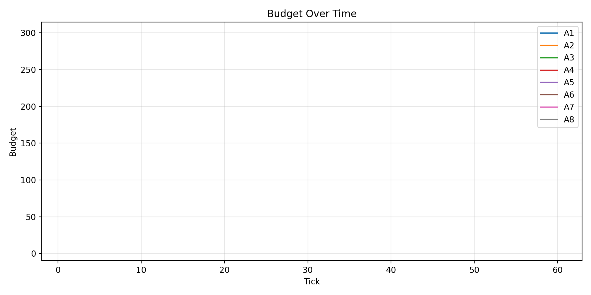

# 🧠 Multi-Agent Credit Economy (LLM)


Агентная модель кредитной экономики, в которой решения принимаются LLM-агентами (через Ollama).

Проект исследует динамику:
- капитала агентов
- рыночных сделок
- процентных ставок
- неравенства (коэффициент Джини)

---

# 🎯 Цель проекта

Проверить, как автономные LLM-агенты ведут себя в рыночной среде без централизованного регулирования.

Мы моделируем:
- заёмщиков (Borrowers)
- кредиторов (Lenders)
- кредитный рынок с матчингом по ставке

И наблюдаем:
- кто банкротится
- кто аккумулирует капитал
- растёт ли концентрация богатства
- стабилизируется ли рынок

---

# 🏗 Архитектура модели

## Участники

### 👤 Borrower
- запрашивает кредит
- задаёт максимальную ставку
- получает средства при успешной сделке
- может стать банкротом

### 🏦 Lender
- предлагает капитал
- задаёт минимальную ставку
- получает процентный доход

---

## ⚙ Механика рынка

1. Агенты формируют заявки.
2. Заёмщики сортируются по объёму.
3. Кредиторы сортируются по ставке.
4. Происходит матчинг.
5. Деньги переводятся.
6. Обновляются бюджеты.
7. Логируются метрики в CSV.

---

# 📊 Результаты последнего прогона

## 🎬 Динамика рынка


---

## 📈 Итоговое состояние экономики


---

## 📊 Сравнение начала и конца

| Начало | Конец |
|--------|--------|
|  |  |

---

# 🔬 Research Summary

### Методология

- Агентная модель
- LLM-решения через Ollama
- Рыночный матчинг по ставке и объёму
- CSV-логирование
- Анализ через pandas
- Визуализация через matplotlib
- Расчёт коэффициента Джини

---

### Ключевые наблюдения

- Рынок быстро входит в фазу волатильности.
- Капитал начинает концентрироваться у 1–2 агентов.
- Неравенство (Gini) со временем растёт.
- После активной фазы рынок частично стабилизируется.
- Поведение чувствительно к параметрам стратегии.

---

### Ограничения модели

- Упрощённая логика кредитов.
- Нет долгосрочных обязательств.
- Нет регулятора.
- Нет риска дефолта по времени.
- LLM действует в ограниченном контексте.

---

# 🛠 Технологический стек

- Python 3.10+
- Ollama (локальная LLM)
- requests
- pandas
- matplotlib
- CSV-логирование
- flake8
- black

---

# 🧹 Code Quality

Проект проверяется:

```bash
flake8 .
black .
```

Настройки:
- max-line-length = 120
- исключены W503, E203 (совместимость с black)

---

# 🚀 Запуск проекта

## 1️⃣ Клонировать репозиторий

```bash
git clone https://github.com/imidg1825/multiagent-credit-economy-LLM.git
cd multiagent-credit-economy-LLM
```

---

## 2️⃣ Создать виртуальное окружение

```bash
python -m venv venv
source venv/bin/activate
```

Windows:
```bash
venv\Scripts\activate
```

---

## 3️⃣ Установить зависимости

```bash
pip install -r requirements.txt
```

---

## 4️⃣ Запустить симуляцию

```bash
python main.py
```

---

## 📊 Перестроить графики из CSV

```bash
python plot.py run_log.csv
```

---

# 📁 Структура проекта

```
main.py           — логика экономики
plot.py           — построение графиков
run_log.csv       — лог симуляции
plots/            — сохранённые графики
requirements.txt
README.md
```

---

# 📦 Репликация эксперимента

- Все параметры заданы в коде.
- Логи сохраняются в CSV.
- Графики строятся из логов.
- Последний прогон зафиксирован в репозитории.

---

# 🚀 Возможные улучшения

- Добавить регулятора рынка.
- Ввести риск-скоринг.
- Многопериодные кредиты.
- RL вместо LLM.
- Массовые параллельные симуляции.
- Сравнение стратегий агентов.

---

# 👨‍💻 Автор

Ivan Maznitsyn  
https://github.com/imidg1825
