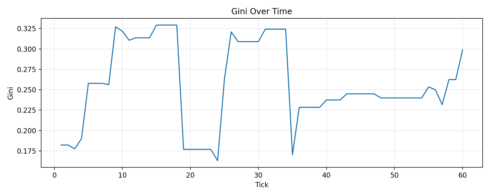

# Multi-Agent Credit Economy  
### Симуляция кредитной экономики с LLM-агентами (Ollama)

---

## 📌 Зачем этот проект

Современные LLM-модели способны принимать решения в динамической среде.  
Но как они будут вести себя в экономике с ограниченными ресурсами, долгами и риском?

Этот проект — эксперимент по моделированию микроэкономики, в которой:

- агенты принимают решения с помощью LLM,
- существует рынок задач,
- существует кредитный рынок,
- возможны дефолты,
- формируется экономическое неравенство.

Цель — проверить, возникает ли устойчивая динамика и “живая” экономика,
или система быстро деградирует.

---

## 🎯 Что мы сделали

Мы реализовали симулятор кредитной экономики со следующими компонентами:

### Участники:
- 4 LLM-агента с разным уровнем риска
- 1 банк (кредитор)

Каждый агент имеет:
- бюджет
- score (накопленный доход)
- репутацию
- склонность к риску
- склонность избегать долгов

---

### Рынок задач

Каждый тик генерируются задачи трёх типов:

| Тип | Стоимость | Доход | Особенность |
|------|------------|--------|-------------|
| small | низкая | стабильный | всегда доступны |
| mid | средняя | средний ROI | умеренный риск |
| jackpot | высокая | очень высокий ROI | часто требует кредита |

---

### Кредитный рынок

Реализованы:

- заявки на займ (borrow orders)
- заявки на выдачу займа (lend orders)
- механизм матчинга
- кредитные контракты
- дефолты
- репутационные штрафы

Банк динамически выдает кредиты под процент.

---

### Логика одного тика

1. Генерация новых задач  
2. Выбор агента (round-robin)  
3. LLM выбирает действие:
   - solve
   - borrow
   - lend
   - repay
   - post
   - skip  
4. Fallback-логика при ошибках  
5. Клиринг кредитного рынка  
6. Экспирация задач и займов  
7. Расчет метрик  

---

## 📊 Что получилось (результаты прогона)

---

## 📊 Результаты симуляции

### Динамика бюджета агентов

<p align="center">
  
</p>

### Индекс неравенства (Gini)

<p align="center">
  
</p>

### Общая динамика экономики

<p align="center">
  
</p>

---

### Динамика бюджета агентов


В ходе симуляции наблюдалось:

- Формирование неравенства
- Появление “лидера”
- Периодические перераспределения через кредиты
- Дефолты при высоком риске

---

### Индекс неравенства (Gini)


Gini колебался в диапазоне примерно 0.16–0.33.

Это означает:
- Экономика не была полностью равной
- Но и не скатывалась в абсолютную монополию
- Неравенство формировалось волнами

---

### Общая динамика экономики


Наблюдалось:
- Появление кредитных сделок
- Накопление дефолтов
- Активность LLM-агентов
- Стабильность тик-цикла (без крашей)

---

## 🔎 Выводы эксперимента

1. LLM-агенты способны формировать экономическую динамику.
2. Jackpot-задачи являются триггером кредитного рынка.
3. При высоком риске возникают дефолты.
4. Банк стабилизирует систему, но не устраняет неравенство.
5. Экономика остаётся устойчивой при наличии fallback-логики.

---

## 🛠 Технологический стек

- Python 3.10+
- Ollama (локальная LLM)
- requests
- pandas
- matplotlib
- CSV-логирование метрик

---

## 🚀 Как запустить проект у себя

### 1️⃣ Клонировать репозиторий

```bash
git clone https://github.com/your-username/multiagent-credit-economy.git
cd multiagent-credit-economy

